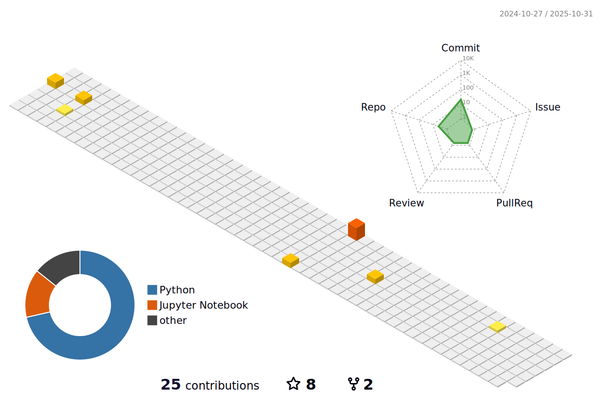

# My Stats 

## 🌐 Socials:
 

# 💻 Tech Stack:
            
# 📊 GitHub Stats:
 
 

## 🏆 GitHub Trophies

### ✍ Random Dev Quote

### 🔝 Top Contributed Repo

### 😂 Random Dev Meme

---

